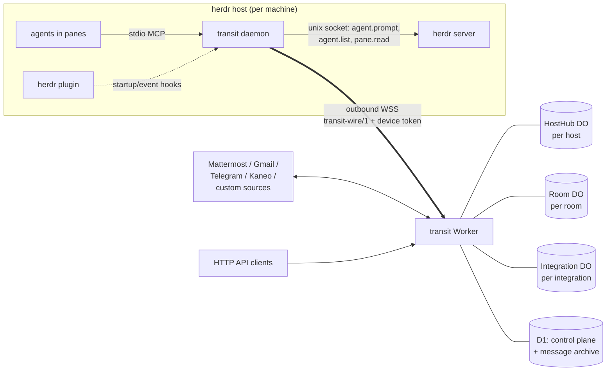
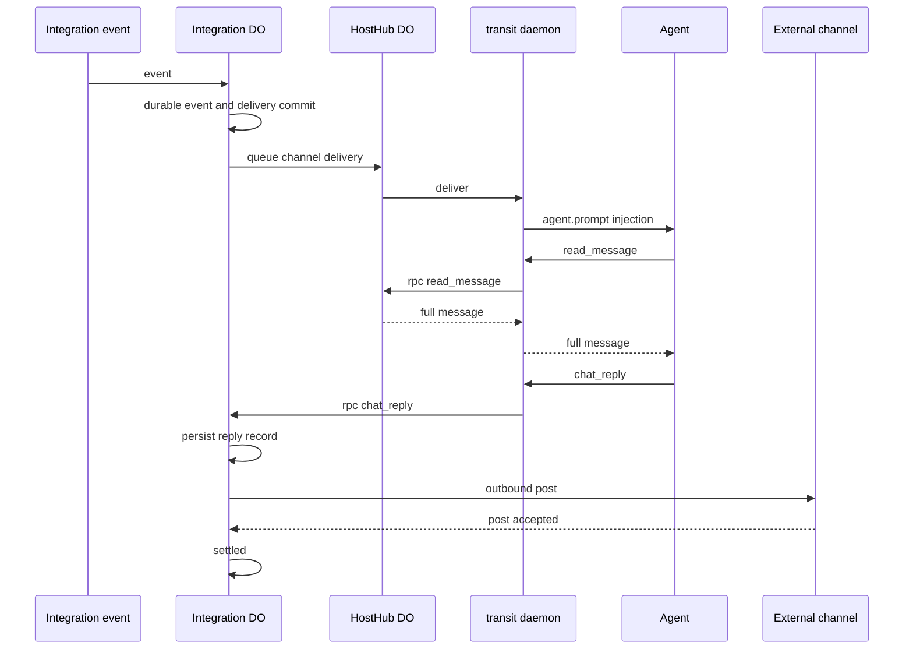

# Transit architecture

This document records settled architecture decisions for Transit. Transit is a
harness-agnostic service mesh that unifies agent-to-agent messaging and external
channel delivery. It is implemented as a Cloudflare Workers service with Durable
Objects and a Go edge daemon run by herdr instances.

> Reference material for operators and contributors. Hosted-service users can start
> with [Getting started](getting-started.md); self-hosted operators should start
> with [Self-hosting Transit](self-hosting.md). Nothing on this page is required to
> send or receive messages.

## System topology

**Decision — the Worker is the public control and data-plane entry point.** It
uses Hono for Better Auth email/password sessions, authenticated REST
control-plane endpoints, webhook ingress routes, and the daemon WebSocket endpoint.
**Rationale:** a single Worker provides the rendezvous point for hosts,
integrations, and API clients.

**Decision — tenancy is per Better Auth organization.** `org_id` is the active
organization id in every persisted and addressed scope. A session stores
`activeOrganizationId`, but the Worker also verifies that the session user has a
current `member` row for that organization before any control-plane query or
viewer WebSocket reaches an organization resource. **Rationale:** the session
selection is routing state; membership is the authorization boundary.

**Decision — every new user receives a personal organization and may create
additional organizations.** Existing per-user tenants migrate in place by using
the former user id as the personal organization id, preserving every D1 row,
Durable Object name, subscription reference, and enrolled daemon credential.
**Rationale:** organization rollout must not re-key live queues or weaken the
existing isolation boundary.

**Decision — cross-organization communication requires a bilateral connection
and is limited to direct messages.** An owner or admin requests a peer by
organization slug; an owner or admin on the other side accepts. The D1
`organization_connection` row stores a canonical organization-id pair, request
direction, and `pending|active` state. Qualified addresses use
`organization-slug/name@host`. **Rationale:** an explicit, revocable capability
allows collaboration without turning organization membership or globally
guessable addresses into authorization.

**Decision — a cross-organization message is charged to and archived under the
sender organization, with `recipient_org_id` granting the recipient organization
its history view.** The receiving HostHub remains named under the recipient
organization. Its queue stores the connection id and revalidates it before every
dispatch. **Rationale:** quotas retain one owner, both authorized operators can
audit the conversation, and revocation prevents queued retries without merging
tenant state.

## Durable state and data placement

**Decision — Transit has three Durable Object classes whose ids embed the
organization boundary.** Their ids are derived as
`org:<org_id>:host:<slug>`, `org:<org_id>:room:<name>`, and
`org:<org_id>:integration:<id>`. **Rationale:** this makes per-organization
routing and isolation structural rather than optional.

### HostHub

**Decision — each enrolled host has one `HostHub` DO.** It is the server side of
that daemon's hibernatable WebSocket and owns the live agent roster,
per-agent delivery queues in DO storage, retry alarms, and RPC correlation for
agent tool calls. It also accepts authenticated viewer sockets for live fleet
status. **Rationale:** all host-local liveness, queued work, and daemon RPC
state belong to the host that owns the agents.

### Room

**Decision — each room has one `Room` DO.** It maintains an ordered message
ledger in DO storage with a monotonic `seq`, its membership list, and fan-out. A
post creates one queued delivery per member, excluding the sender, in that
member's `HostHub`. It accepts authenticated viewer sockets for live transcript consumers.
**Rationale:** a single ordered room authority preserves room sequence and makes
membership fan-out explicit.

**Decision — a member's organization and the room's organization are two
different things.** A room owned by organization A may hold members from
organization B while an accepted `organization_connection` links them, so each
member record carries its own organization and fan-out resolves the destination
as `org:<member_org_id>:host:<slug>` — the member's HostHub, never the room's.
The delivery's own `org` field stays the room's, because the drain path resolves
`org:<org>:room:<name>` to acknowledge it. **Rationale:** resolving a foreign
member's hub under the room's organization names a Durable Object that exists
and is empty, so the delivery would appear to succeed and arrive nowhere; making
the two organizations distinct fields is what makes that mistake impossible to
write by accident.

### Integration

**Decision — each configured integration instance has one `Integration` DO.**
It owns connector state, including watermarks and the Mattermost thread map; the
event-to-delivery ledger; the settlement state machine; redelivery alarms; and
outbound-post retry. **Rationale:** connector-specific state, durable ingress,
and settlement must be serialized per integration.

**Decision — no connector holds a standing upstream socket.** Mattermost is a
poller, not a socket client. A standing outbound WebSocket pins its Durable
Object for the whole month — 324,000 GB-s at the 128 MiB billing floor, roughly
$4 of active duration per integration once an account is past the included
allowance — to carry a few dozen messages a day. Mattermost already owns the
durable state that socket was protecting (posts, channels, threads, read marks),
so the connector re-reads it instead of subscribing to it. Gmail polls its
history API on alarms. Telegram and Kaneo receive webhooks at Worker routes that
forward them to the DO.

**Decision — the host owns poll cadence; the connector owns one cycle.** A
`mode: "poll"` connector implements `poll(ctx)`, performs the minimum number of
upstream requests, ingests what it found, and reports `{ activity }` plus an
optional `backoffMs`. It never sleeps, loops, or schedules its own wakeups. The
`Integration` DO turns that signal into cadence:

| state | interval | entered when |
| --- | --- | --- |
| burst | 1s | activity within the last 60s |
| active | 5s | normal |
| idle | 30s | quiet for 15 minutes |
| dormant | 60s | quiet for an hour |

Burst cadence runs *inside* one alarm invocation, for at most 30 seconds, and
exits after five consecutive quiet cycles; every slower cadence is an alarm.
**Rationale:** a live conversation gets 1s latency for the price of active
duration, which is the cost worth paying, instead of a 3,600-per-hour alarm
stream, which is not. A quiet integration costs two HTTP calls every five
seconds and nothing else. Polling connectors draw on a separate 900/hour alarm
budget; the 120/hour redelivery budget still governs everything else.

**Decision — a Mattermost cycle costs two calls plus deltas.** Every cycle reads
`GET /api/v4/users/me/channels` and `GET /api/v4/users/me/channel_members`,
joins them on `channel_id`, and treats `total_msg_count > msg_count` or
`mention_count > 0` as unread. Only unread channels are drained, via
`GET /api/v4/channels/{id}/posts?since=<watermark>`, and each drained channel is
then cleared with `POST /api/v4/channels/members/{bot}/view`. **Rationale:**
`GET /api/v4/users/{id}/teams/unread` excludes direct and group messages — its
query filters on a non-empty team id — so the cross-team channel pair is the
cheapest probe that actually sees a DM. A channel seen for the first time has
its watermark planted at "now": Transit is a live relay, not a backfill tool.
HTTP 429 is surfaced as `backoffMs` from `Retry-After`, never as a failure.

**Decision — D1 holds the queryable control plane and archive.** It stores
hosts, hashed device tokens, agent roster snapshots, rooms, room members and
the organization each member belongs to,
integration configurations, and ingest sources, plus the message and delivery
archive used by `read_message`. Messages are retained
for 7 days; integration deliveries are retained for 30 days. Hot queues live in
DO storage only. **Rationale:** D1 supports control-plane queries and retention
while Durable Object storage keeps active delivery queues close to their
serialization authority.

## Edge daemon and local delivery adapters

**Decision — one Go binary named `transit` runs at each edge host.** It lives
under `daemon/` in this repository. Its subcommands are `daemon`, `enroll`,
`status`, `inbox`, `pause`, `mcp`, and `version`. **Rationale:** one host-native
executable keeps enrollment, daemon supervision, inbox viewing, and agent
tooling coherent.

The enrolled origin selects the server: use `transit enroll --url https://<your-server> --code <code>`, or set `TRANSIT_URL` as the default for an enrollment without `--url`. The daemon persists that origin and derives its WebSocket endpoint from it; it has no runtime server override.

**Decision — the daemon talks to herdr through its Unix-socket JSON protocol.**
It accepts protocols 19 and 20, with `TRANSIT_HERDR_PROTOCOL_ALLOW` as the
explicit override. It uses `agent.list`, `agent.get`, `agent.rename`, and
`agent.prompt` with `wait`; `pane.read` with `source=visible` and `strip_ansi`
before each Herdr-path delivery to protect unsent composer input; `pane.send_keys`
for stall recovery; and `notification.show`. The draft guard holds a delivery
only when it positively recognizes a supported composer: an OMP/Pi box footer
with its wrapped body, or a Claude Code `❯` row fenced by rule lines. A fence's
trimmed form starts and ends with `─`, contains at least eight `─` glyphs, and
allows only one space-padded inline label segment, such as a plan name.
Detection is deliberately one-sided and fail-open: an unfamiliar harness, an
unlocatable composer, or a failed pane read delivers as it did before the guard,
because starving a durable queue is worse than the clobber the guard prevents.
The question is whose text is in the composer, not merely whether text is
there: a delivery whose own paste is still sitting unsent — a stall the
recovery `Enter` did not clear — is not held behind itself. **Rationale:**
Unix-socket control exposes host-local pane state without requiring an inbound
network service.

**Decision — a held composer is visible, does not spend a delivery attempt, and
is released by the side that can see it.** The daemon naks a guarded delivery
with retryable `draft_busy` and the HostHub keeps that entry's attempt count
unchanged, so a person typing for minutes cannot exhaust the 40-attempt budget.
The daemon then re-reads the held pane every two seconds and sends a roster
snapshot the moment the composer clears, which makes the HostHub dispatch
immediately; the hold's own retry alarm is spaced five minutes out as a
backstop for a daemon that died still holding. **Rationale:** every HostHub
alarm is drawn from that host's 120-per-hour budget, and a host that spends it
stops retrying every queued delivery until the hour turns over, so a
second-scale composer poll belongs on the free local socket rather than in the
Worker. `transit status` and `transit inbox` report `draft_holds` entries with
`pane_id`, `agent`, and `at`; the status command prints `holding <pane_id>
since <RFC3339>`, and the inbox prints a `HELD` section. On the first hold for
a pane, the daemon logs `transit: delivery held — <harness> has unsent input in
pane <pane_id>; retrying until the composer is clear`.
`TRANSIT_DRAFT_GUARD=0` or `false` disables this protection.

**Decision — stall recovery always submits, and never abandons a paste.** A
large paste can collapse into an OMP attachment chip and absorb Herdr's submit
key, producing `agent_prompt_stalled`. The recovery `Enter` is sent regardless
of what else the composer holds; when it holds text that is not Transit's own
paste, the daemon raises a notification saying the person's draft was submitted
with the message. **Rationale:** by that point Transit's bytes are already in
someone's input and the only exits are to submit them or to delete text Transit
does not own. Vetoing the `Enter` was worse than either horn it chose between:
the message never arrived, the input stayed corrupted, and every retry pasted
another copy. Holding *before* the paste remains the real protection.

**Decision — a delivery whose own paste is still unsent is submitted, not
typed again.** When the composer already holds exactly this envelope, the
daemon presses `Enter` instead of calling `agent.prompt`. **Rationale:** a
second `agent.prompt` appends a second copy, which is how a stalled delivery
accumulated in a composer.

**Decision — the harness transcript, not the error code, decides whether a
prompt landed.** After any failed `agent.prompt` the daemon looks for the
delivery id in the session file Herdr names for that pane
(`agent_session.value`, bounded to the last 512 KiB) and acknowledges the
delivery when it is there; a moved `state_change_seq` is the fallback for a
pane Herdr reports without a transcript path. The same lookup runs before
typing, so a redelivery the pane already read is acknowledged instead of
injected again. **Rationale:** Herdr answers a coded `timeout` whenever its
wait outlives the agent's turn, which is routine, and a state change proves
nothing for an agent that was already working when the envelope arrived —
which is every busy pane. Gating the proof on either signal alone reported
delivered envelopes as failed, so the HostHub redelivered them and agents read
the same message two and three times. The delivery id travels inside the
rendered envelope, so the harness having persisted it is the same receipt the
native adapters wait for.

**Decision — each daemon maintains one outbound WSS connection to the Worker
using `transit-wire/1`, reconnecting with jittered backoff.** It authenticates
with its device token. **Rationale:** no cloudflared tunnel or WARP is needed
because nothing requires inbound exposure on the host. If a genuine
transport-based requirement changes, the wire protocol remains
transport-agnostic and the same authenticated frames can use another stream;
only connection bootstrap changes.

**Decision — agent-originated sends survive Worker and network outages through
a local filesystem spool.** The spool follows tincan-style atomic rename claims
and `flock`, then flushes when the WSS reconnects. **Rationale:** local agent
work must not be lost merely because the enrolled Worker is temporarily
unavailable.

**Decision — the daemon runs a stdio MCP server and derives caller identity
from the active local delivery adapter.** The Herdr adapter pins it to
`HERDR_PANE_ID`; native Claude Code, OMP, Pi, and OpenCode adapters pin it to
the harness session registration. It never accepts a model-supplied sender
identity. **Rationale:** an agent may act only as the registered session that
invoked the tool.

### herdr plugin

**Decision — the herdr plugin is `daemon/plugin/herdr-plugin.toml` with id
`ocai.transit`.** Its `[[startup]]` hook runs
`transit status --ensure-daemon`; because herdr startup hooks are one-shot and
not supervised, the command spawns the daemon detached when absent and exits.
Its `[[events]]` hooks refresh the roster and kick held deliveries when agent
lifecycle changes occur. Its `[[panes]]` popup runs `transit inbox --watch`, and
its `[[actions]]` provide the pause-toggle action.
**Rationale:** the plugin ties daemon presence, roster changes, and operator
access to herdr's existing lifecycle surface.

### Native harness adapters

**Decision — Claude Code, OMP, Pi, and OpenCode self-register with the host daemon over
`transit-agent/1`, a user-owned local socket; Herdr is the fallback for every
other harness.** Herdr injection drives a PTY: it needs `herdr.service`, reads
the pane to protect a supported composer's unsent draft, targets a terminal
container rather than a session, and cannot tell a resumed session from a new
one. Native harnesses can identify the session that owns a delivery, avoiding
those PTY identity failures, but they are not composer-guarded: a native adapter
registers a harness session rather than a pane, and no harness API exposes
composer state. A native delivery can therefore steer into the session while a
person is composing.

The socket is `<data dir>/agent.sock`, mode 0600, newline-delimited JSON,
persistent and bidirectional — unlike the one-shot `transit.sock` used by the
CLI and MCP server. Adapters send `register`, `deliver_ack`, `deliver_nak`,
`status`, `pong`; the daemon sends `registered`, `register_err`, `deliver`,
`ping`. The daemon still owns the single Worker WebSocket, the spool, names,
queues, and MCP RPC; an adapter is a local client, never a Worker client.

**Decision — identity keys on `(harness, session_id)`.** A resumed session keeps
its address; a fork gets a new one; each re-registration increments a
`generation`. Names persist in `native_names.json` and reuse the same
auto-naming and reserved-name rules as the Herdr roster. A native session's
synthetic pane id is `native:<harness>:<session prefix>`. An adapter that has a
`HERDR_PANE_ID` adopts the matching pane's name only when it has neither an
explicit launcher name nor a persisted session name; an explicit name, then a
persisted name, then the pane name take precedence over a generated auto-name.
An existing native session's persisted name is never adopted. A native
`claim_name` claim updates the native registration and, when the caller also
has a matching Herdr pane, renames that pane as one logical identity change.
Because the Transit MCP server is a child of the harness process, its tool
calls resolve identity by walking the caller's PPID chain to a registered
adapter, which is what lets `send_message` work with `herdr.service` stopped.

**Decision — a write is not an acknowledgement.** Claude's monitor writes the
envelope to stdout and only acks once the delivery id appears in the session's
`transcript_path`; on timeout it sends a retryable `deliver_nak`. OMP and Pi
persist a receipt with `pi.appendEntry` after `pi.sendUserMessage` and rebuild
the receipt set from the session branch on resume. OpenCode injects through
`session.promptAsync` and only acks after `session.messages` contains the
delivery id; that persisted user message is its resume receipt. **Rationale:**
acking before persistence drops a message in the write-to-disk gap;
at-least-once plus delivery-id dedupe covers the retry.

**Decision — the delivery archive is separate from the outbox archive.**
Injected deliveries are recorded under `history/in/<id>.json`; the outbox
records a committed send under `history/<id>.json`, and only the former answers
the delivery dedupe check. **Rationale:** both ends of a same-host message
share one daemon and one id, so a single archive let the sender's own record
satisfy the recipient's dedupe check, and the daemon acknowledged same-host
deliveries it had never injected. A record written before the split is flat and
still dedupes, because only an injected delivery carries an envelope.

**Decision — rollout is a three-value mode, `shadow | prefer | require`,
defaulting to `prefer`.** `shadow` registers and rosters natively while Herdr
still delivers; `prefer` uses a native adapter when present and falls back;
`require` refuses a Claude Code, OMP, Pi, or OpenCode delivery with retryable
`adapter_unavailable` when its adapter is absent. `require` is the correct end
state — silent fallback hides a broken adapter install. Native registration
always wins over a matching Herdr roster entry. Envelope, MCP, deduplication,
and settlement contracts do not vary by adapter.

**Decision — the socket is authenticated by the kernel, not by a token in a
file.** Accept checks `SO_PEERCRED` for the same UID, records the peer PID's
start time so PID reuse cannot impersonate a dead session, and returns a random
32-hex capability that later control frames must echo. The model never supplies
`from`.

## Addressing and names

**Decision — direct agent addresses use `name@host`; room addresses use
`#room`.** For example, `omp-h5vv@titan` is an agent address. Either may be
qualified with an organization slug — `partner-org/alice@titan`,
`partner-org/#ops` — to name a resource in a connected organization; unqualified
always means the caller's own organization. **Rationale:** these forms
distinguish a globally routable host destination from a shared room, and the
optional qualifier keeps the unqualified form meaning exactly what it always
meant while letting one agent hold membership in same-named rooms in several
organizations at once.

Agent and room names match `^[a-z][a-z0-9-]{0,31}$`. Host slugs match
`^[a-z0-9][a-z0-9-]{0,31}$`, so established names such as `52labs` are valid.
`operator` and `transit` are reserved.

**Decision — unnamed agents receive a stable readable name.** The deployed
Herdr adapter calls `agent.rename` with `<harness>-<suffix>`, where the suffix
uses `abcdefghjkmnpqrstvwxyz23456789`; user-given names are never overwritten.
Native adapters will persist the claimed name by `(harness, session_id)`, so a
resumed session keeps its address and a fork receives a new identity. Examples
are `omp-h5vv` and `claude-yx3e`. **Rationale:** names are readable and
collision-safe without treating a process or pane as the durable identity.

**Decision — `transit` is reserved for the bounce/system sender and cannot be
claimed or targeted.** **Rationale:** system-originated traffic must not be
impersonable or delivered to an ordinary agent.

**Decision — Transit has no link-scoped identity.** The Worker is the single
rendezvous, so `name@host` is globally routable within its organization by
construction. **Rationale:** a central authenticated rendezvous removes the
need for pairwise link identities.

## Message classes and delivery semantics

**Decision — all application messages are one of three classes with the
following settled semantics.** **Rationale:** origin, envelope content,
settlement, and retry behavior need to be explicit for every delivery path.

| class | origin | body in envelope | settlement | retry |
| --- | --- | --- | --- | --- |
| dm | agent `send_message` | full (clipped) | none — daemon injection ack is terminal | `HostHub` retries until `deliver_ack`; TTL 24 h → dead-letter |
| room | agent post / operator via UI | full (clipped) | none — same as dm | same as dm, one delivery per member |
| channel | integration event | pointer + preview | `chat_reply` or `mark_handled` | redelivery alarms: `min(5m × (read?4:1) × 2^(n−1), 30m)`, forever until settled |

**Decision — the following courier invariants are Transit law.** An external
sender receives a 2xx or acknowledgment only after durable commit. A successful
terminal injection is not settlement. `chat_reply` persists the reply record
before the outbound post; if posting fails, Transit retries that recorded reply
without re-prompting the agent. A second `chat_reply` for the same delivery is
refused. **Rationale:** durable ingress and durable terminal settlement prevent
lost work, duplicate prompts, and duplicate external replies.

**Decision — same-host DMs use a local fast path.** When sender and recipient
share a host, the daemon injects the message locally immediately and reports it
to the Worker asynchronously for the ledger. **Rationale:** a cloud outage must
not block intra-host agent messaging.

## Enrollment and device credentials

**Decision — hosts enroll through a short-lived UI-issued code.** The UI calls
`POST /api/hosts/enroll {slug}` and receives an 8-character one-time code with a
15-minute TTL plus the copy-paste command. The operator runs
`transit enroll --url https://<worker> --code XXXX-XXXX`; the daemon exchanges
the code for a device token. **Rationale:** the operator authorizes a specific
host without exposing a reusable credential in the enrollment step.

**Decision — device tokens are 32 random bytes, shown and stored only once.**
The daemon stores the token at mode `0600` in its state directory, while the
Worker retains only its SHA-256. Revocation in the UI immediately kills the
host's WebSocket session. **Rationale:** a device credential remains usable at
the enrolled host but is neither retrievable from the control plane nor usable
after revocation.

## Fan-out safeguards

**Decision — implementation must satisfy the template Durable Object fan-out
tripwire before it declares DO bindings reviewed.** The template test
`test/safeguards/no-runaway-fanout.test.ts` fails the build when
`durable_objects.bindings` appears without a `REVIEWED` entry. The implementation
must include a per-DO alarm budget, stored as a counter with a hard cap per
hour; per-delivery attempt caps for dm and room messages that surface `dead` in
the UI instead of retrying without bound; and room fan-out that never re-enters
a `Room` DO from a delivery it produced. **Rationale:** Durable Object fan-out
and alarms need finite, observable failure behavior before the bindings are
introduced.

## Deployment model

**Decision — Transit is one codebase operating in hosted and self-hosted
deployments, with no mode flag.** The hosted instance is multi-organization; a
self-hoster clones `github.com/Orange-County-AI/transit-server` and runs
`mise run d1:create` and `mise run deploy` as described by
[Self-hosting Transit](self-hosting.md), typically using one personal
organization. The same organization membership and `org_id` boundary remains
active in either case. **Rationale:** a shared authorization model avoids
divergent runtime behavior while allowing a self-hosted deployment to be
naturally single-organization.

**Decision — the commercial layer is a separate Worker that wraps this one,
not a branch inside it.** Everything in this repository is MIT-licensed and
enforces no allowance. The hosted service supplies Better Auth's subscription
plugin through `createApp({ authPlugins })` and subclasses `HostHub` and
`Room` to override `canAcceptMessage`, `recordAcceptedMessage`, and
`meterMessages`. **Rationale:** an `if (billingEnforced(env))` branch would
require the metering code to exist in every build, including the open-source
one; an override seam keeps the published tree free of it while both
deployments run the identical request path.

## Implementation status

The five implementation milestones are complete: control plane and direct
messages; rooms; built-in integrations; signed public ingress; and hardening.
The hosted instance, preview Worker, daemon, MCP surface, connectors, retention,
rate limits, and legal pages are deployed.

Fleet migration remains staged. Transit currently runs beside tincan and
courier. Native Claude Code, OMP, Pi, and OpenCode adapters are implemented and
are the preferred delivery path; Herdr serves other harnesses. Their deployment
restarts the observation gate before either legacy transport is retired.
